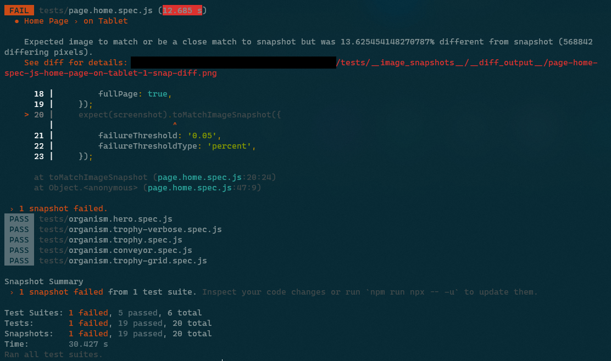
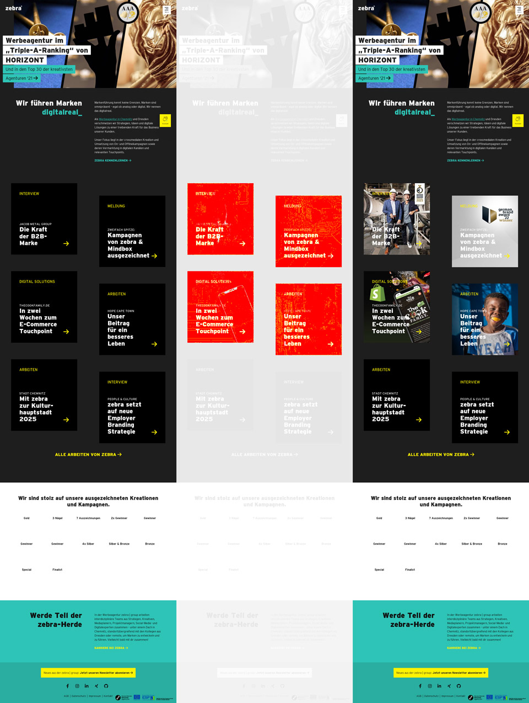

When we continue or further develop a web project, we don't want an enhancement to trigger a domino effect and unwanted layout changes to happen somewhere else on the website. It is tedious to manually scan all possible (and impossible) pages of the website. So why not let a machine do the job?

===

## Visual Regression Testing

... describes a testing method in which the interface (what users see) is checked. We apply the same standards as if we were navigating the page ourselves. Is element X in the right place, is element Y the right size, is element Z present, is there the right text in it, etc.?

With each test run, a screenshot is taken and compared with the screenshot of the initial situation. If there is an intentional deviation, for example after a layout adjustment, the new screenshot can be set as the basis for future comparisons. If a component or its test is new, the screenshot from the first run is automatically set as the basis.

Most time, a headless browser is used for the test. This means that the test software opens a browser, but we do not see it. The rendering of the page is done completely in the background. It saves time and resources that a user interface does not have to be loaded first or the results of the rendering displayed. At the same time, the browser can also be controlled. So scrolling, clicking, hovering, making entries, etc. are all possible.

> Shut the f up and show me some code, NOW!
>
> – Me, when reading tutorials. All the time.

## Prerequisites / Basics

The examples in the text are meant for classical websites and architectures (PHP based CMS like [grav](/blog/introducing-grav-cms)). With JengaScript frameworks, the tests can be approached differently, but I will not describe this here since there are tutorials that cover this better.

I also work with a Debian Linux within the <abbr title="Windows Subsystem for Linux">WSL</abbr>. You may need to adapt certain commands or procedures to your working environment.

## Test environment

For the setup, I decided on a combination of [Jest](https://jestjs.io/) and [Puppeteer](https://pptr.dev/).

!! Ideally, I run the tests before a commit/push into the code repository to put my work to the test. They can also be automated, for example before deployment. However, it must be ensured that the data sources (dev/production database, etc.) are consistent so that the tests do not fail unnecessarily because of different texts or arrangements.

First we install the necessary (node) packages as development dependencies:

```
npm i -D puppeteer jest jest-image-snapshot jest-puppeteer
```

Puppeteer comes with its own headless Chrome browser, which is stored in `~/.cache`. When the tests just wouldn't run, it occurred to me at some point that the browser might need a few more dependencies. So I installed a few more packages:

```
sudo apt-get update && sudo apt-get install -y gconf-service libasound2 libatk1.0-0 libc6 libcairo2 libcups2 libdbus-1-3 libexpat1 libfontconfig1 libgcc1 libgconf-2-4 libgdk-pixbuf2.0-0 libglib2.0-0 libgtk-3-0 libnspr4 libpango-1.0-0 libpangocairo-1.0-0 libstdc++6 libx11-6 libx11-xcb1 libxcb1 libxcomposite1 libxcursor1 libxdamage1 libxext6 libxfixes3 libxi6 libxrandr2 libxrender1 libxss1 libxtst6 ca-certificates fonts-liberation libnss3 lsb-release xdg-utils wget ca-certificates
```

A little more configuration:

`./jest.config.js`
```js
module.exports = {
    rootDir: './tests',
    testTimeout: 3000,
    bail: 0,
    preset: 'jest-puppeteer',
    reporters: [
        'default',
        'jest-image-snapshot/src/outdated-snapshot-reporter.js',
    ],
};
```

`./jest-puppeteer.config.js`
```js
module.exports = {
    launch: {
        headless: true,
        // product: 'chrome',
        args: ['--start-maximized'],
        defaultViewport: {
            width: 1920,
            height: 1080,
        },
    },
    browserContext: 'default',
};
```

`./package.json`
```json
    …
    "scripts": {
        …
        "test": "npx jest --detectOpenHandles --forceExit",
        "test:all": "npm run lint && npx jest --detectOpenHandles --forceExit",
        "test:update": "npx jest --updateSnapshot --detectOpenHandles --forceExit"
        …
    }
    …
```

The three scripts added to `package.json` do the following: `test` runs all tests in the `tests` folder. `test:all` does the same but only after the code has been checked with all linters. `test:update` writes all new screenshots that contain discrepancies as a new base for future tests.

! A note before starting: In blogs and articles, the objects `browser` and `page` are often initialised with puppeteer. But the package `jest-puppeteer` takes care of this for us and we can write our tests more compactly.

## Testing Pages

Screenshots of entire pages can help to find errors in the interaction of components that are not noticeable when looking at components individually. However, false alarms can occur more often due to changes in the content or the loading behaviour of the headless browser. Therefore, only important/critical pages should be run as full page tests.

The tests are written in JavaScript/Node and are located in the folder `./tests`. `./` is here relative to `package.json`. The screenshots that serve as a basis for comparison are stored in `./tests/__image_snapshots__/`. When naming the files, only the suffix `.spec.js` is important.

`./test/page.home.spec.js`
```js
/**
 * @jest-environment puppeteer
 */

const { toMatchImageSnapshot } = require('jest-image-snapshot');
expect.extend({ toMatchImageSnapshot });

const url = 'http://prvzbr.ddev.site';

async function run() {
    await page.setCacheEnabled(false);
    await page.goto(url, {
        waitUntil: 'networkidle0',
    });

    const screenshot = await page.screenshot({
        fullPage: true,
    });
    expect(screenshot).toMatchImageSnapshot({
        failureThreshold: '0.05',
        failureThresholdType: 'percent',
    });
}

jest.setTimeout(5000);

describe('Home Page', () => {

    test('on Desktop', async function() {
        await page.setViewport({
            width: 1920,
            height: 1080
        });

        await run();
    });

    test('on Tablet', async function(){
        await page.setViewport({
            width: 1024,
            height: 768,
            isMobile: true,
            hasTouch: true,
        });

        await run();
    });

    test('on Mobile', async function(){
        await page.setViewport({
            width: 375,
            height: 640,
            isMobile: true,
            hasTouch: true,
        });

        await run();
    });
});
```


In the comment block we instruct jest that this is a Puppeteer test. This provides us with the necessary prerequisites. Then we define that we will use `toMatchImageSnapshot` to compare the screenshots.

This example is for a classic PHP-based tech stack. So we assume that we have a web server running locally (in my case [ddev](https://ddev.com/) does that) and put the address of the page to visit into a constant.

I put the things that repeat in the subtasks of the test into the function `run`. It clears the cache, visits the URL, takes a screenshot and starts the comparison. The `failureThreshold` data can be used to define how much deviation is allowed. In the example it is 5%.

After the function, I overwrite the maximum time the whole test is allowed to run. In jest.config.js this can also be done globally. Due to delays and waiting for animations/transitions, the globally defined time may not be sufficient and you can allow more time per test.

The actual test is defined with `describe` and in it the things to be checked with `test`. I explicitly define the screen sizes and device parameters at the beginning of the subtasks. Puppeteer could be used to access the device emulation of the Browser Developer Tools, but they changed the syntax at the end of 2022, and I haven`t found [a](https://stackoverflow.com/questions/75072364/how-to-emulate-devices-with-jest-and-puppeteer) [way](https://github.com/smooth-code/jest-puppeteer/issues/510) to use this with jest-puppeteer.

When the test has run, this is acknowledged with a success message. If a change is noticed during the test, the test stops.



In the error message we can read out a deviation of more than 13%. In such a case, a visual diff (comparison and highlighting of the deviations) is created, which we can use to assess what has happened.



It is divided into three sections. On the left we see the basis of comparison, on the right the screenshot taken during the test. In the middle, the deviations can be seen in red on the faded screenshot.

In this specific case, we see that graphics below the fold (outside the viewport when the page is initially loaded) were displayed during the test that were not there in the original. These images are loaded by lazy loading, i.e. only when scrolling close to them. But since there is no scrolling, they should not be visible in the screenshot. Here, the browser cache of our headless Chrome was probably filled up more and more from run to run. This can be good or bad, depending on what you want to test. Since I need a constant behaviour, even if another developer has cloned the repository, I added the line `await page.setCacheEnabled(false);` in the `run` function later.

If this does not help and continues to produce inconsistent results, it may help to wait a short time after loading the page (line with the `setTimeout`).

```js
async function run() {
    await page.setCacheEnabled(false);
    await page.goto(url);
    const organism = await page.waitForSelector(selector);
    await new Promise((r) => setTimeout(r, 200));

    const screenshot = await organism.screenshot();
    expect(screenshot).toMatchImageSnapshot({
        failureThreshold: '0.05',
        failureThresholdType: 'percent'
    });
}
```

Hier noch ein Code-Beispiel wie ich Eaaster Eggs teste:

```js
    test('on Steroids', async function(){
        await page.setViewport({
            width: 1024,
            height: 768,
            isMobile: true,
            hasTouch: true,
        });
        await page.goto(url, {
            waitUntil: 'networkidle0',
        });

        // konami code
        await page.keyboard.press('ArrowUp');
        await page.keyboard.press('ArrowUp');
        await page.keyboard.press('ArrowDown');
        await page.keyboard.press('ArrowDown');
        await page.keyboard.press('ArrowLeft');
        await page.keyboard.press('ArrowRight');
        await page.keyboard.press('ArrowLeft');
        await page.keyboard.press('ArrowRight');
        await page.keyboard.press('KeyB');
        await page.keyboard.press('KeyA');

        // wait for party mode to start
        await new Promise((r) => setTimeout(r, 100));
        // scroll to top
        await page.keyboard.press('Home');
        // wait for scroll
        await new Promise((r) => setTimeout(r, 500));

        const screenshot = await page.screenshot({
            fullPage: true,
        });
        expect(screenshot).toMatchImageSnapshot({
            // comparisonMethod: 'ssim',
            failureThreshold: '0.10',
            failureThresholdType: 'percent',
        });
    });
```

Since I have to do the input of the Konami code between loading the page and the screenshot, I cannot use the `run` function. However, the code could be written even more beautifully, if one attaches importance to it. Since the simulation of arrow keys scrolls the Vieport, I force the scrolling to the top of the page between two timeouts for consistent screenshots.

## Testing Components

To test individual components or DOM nodes, we proceed similarly:

`./test/organism.trophy.spec.js`
```js
/**
 * @jest-environment puppeteer
 */

const { toMatchImageSnapshot } = require('jest-image-snapshot');
expect.extend({ toMatchImageSnapshot });

const url = 'http://prvzbr.ddev.site/a-landingpage';
const selector = '.modular--trophy';

async function run() {
    await page.setCacheEnabled(false);
    await page.goto(url);
    const organism = await page.waitForSelector(selector);

    const screenshot = await organism.screenshot();
    expect(screenshot).toMatchImageSnapshot({
        failureThreshold: '0.05',
        failureThresholdType: 'percent'
    });
}

describe('Organism Trophy', () => {

    test('on Desktop', async function() {
        await page.setViewport({
            width: 1920,
            height: 1080
        });

        await run();
    });

    test('on Tablet', async function(){
        await page.setViewport({
            width: 1024,
            height: 768,
            isMobile: true,
            hasTouch: true,
        });

        await run();
    });

    test('on Mobile', async function(){
        await page.setViewport({
            width: 375,
            height: 640,
            isMobile: true,
            hasTouch: true,
        });

        await run();
    });

});
```

In addition to what has already been described, there is also a constant here with the CSS selector for the element we want to look at. Also, it no longer waits for the page to load but for the element to load.

## Interaction

With `page.hover()`, `page.focus()` and `page.click()` we can trigger different states or interact with the site or component.

```js
test('at Hover', async function(){
    await page.goto(url);
    const organism = await page.waitForSelector('.modular--hub');

    // let it hover and give time to let transitions unfold
    await page.hover('.modular--hub .hub__item:nth-child(2) a');
    await new Promise((r) => setTimeout(r, 300));

    const screenshot = await organism.screenshot();
    expect(screenshot).toMatchImageSnapshot({
        failureThreshold: '0.05',
        failureThresholdType: 'percent'
    });
});
```
If animations or CSS transitions are involved, the interaction must be followed by a timeout so that it can reach its final state before the screenshot is taken.

```js
test('Navigation open + hover', async function(){
    await page.goto(url, {
        waitUntil: 'networkidle0',
    });

    await page.click('label.navigation__trigger');
    // does the element we are looking for exist?
    await page.waitForSelector('div.navigation__layer');
    // wait for the transition to finish
    await new Promise((r) => setTimeout(r, 200));

    // let it hover and give time to let transitions unfold
    await page.hover( '.navigation .menu__item:nth-child(2) a' );
    await new Promise((r) => setTimeout(r, 200));

    const screenshot = await page.screenshot();
    expect(screenshot).toMatchImageSnapshot({
        failureThreshold: '0.05',
        failureThresholdType: 'percent',
    });
});
```
In the example above, the navigation (hamburger menu) is opened and the second navigation element is given the hover state.

## Shortcuts

Run a single test

```
npx jest -i tests/organism.trophy.spec.js
```

run a single sub-test

```
npx jest -i tests/page.home.spec.js -t 'on Mobile'
```

! Since I was allowed to deal extensively with the topic during my working hours, I would like to thank [mindbox](https://mindbox.de/) at this point. By the way, we are currently looking for reinforcement in the development area ;)

## The more you know

Unfortunately, sources on the subject are often outdated or do not fit your own setup. Nevertheless, my sources may be helpful.

* [Puppeteer Docs](https://pptr.dev/)
* [Jest Docs](https://jestjs.io/docs/getting-started)
* [Medium – Visual Regression Testing](https://medium.com/loftbr/visual-regression-testing-eb74050f3366)
* [Awesome Visual Regression Testing List](https://github.com/mojoaxel/awesome-regression-testing)
* [Addy Osmani – Web Performance Recipes With Puppeteer](https://addyosmani.com/blog/puppeteer-recipes/)
* [Chrome Developers – Puppeteer quick start](https://developer.chrome.com/docs/puppeteer/get-started/)
* [Modern Web Testing and Automation with Puppeteer (Google I/O ’19) 📽](https://www.youtube.com/watch?v=MbnATLCuKI4)
* [Codedec – Visual regression testing with puppeteer and Jest](https://codedec.com/tutorials/visual-regression-testing-with-puppeteer-and-jest/)
* [BrowserStack – Puppeteer Framework Tutorial: Basics and Setup](https://www.browserstack.com/guide/puppeteer-framework-tutorial)
* [93 Days – Visual Testing with Jest and Puppeteer](http://93days.me/visual-testing-with-jest-and-puppeteer/)
* [Base Web - Visual Regression Testing ](https://baseweb.design/blog/visual-regression-testing/)