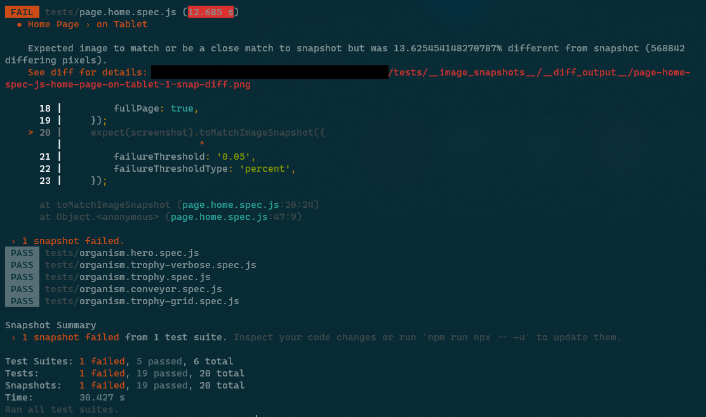
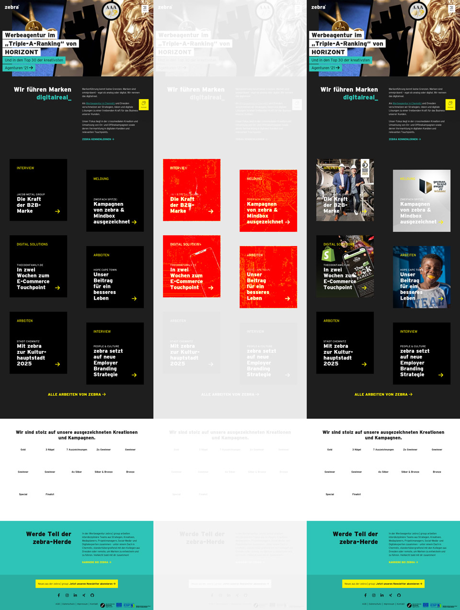

Wenn wir ein Web-Projekt fortführen und weiterentwickeln, wollen wir nicht, dass eine Anpassung einen Dominoeffekt auslöst und irgendwo auf der Website ungewollte Layoutänderungen passieren. Es ist mühsam von Hand alle möglichen (und unmöglichen) Seiten der Website abzusuchen. Also warum nicht eine Maschine den Job machen lassen?

===

## Visual Regression Testing

… beschreibt eine Testmethode, bei der die Oberfläche (was die User sehen) überprüft wird. Dabei setzen wir die selben Maßstäbe an, als wenn wir selbst über die Seite navigieren. Ist Element X an der richtigen Stelle, hat Element Y die richtige Größe, ist Element Z vorhanden, steht da der richtige Text drin, etc.

Bei jedem Testdurchlauf wird ein Screenshot gemacht und mit dem Screenshot der Ausgangssituation verglichen. Wenn es eine beabsichtigte Abweichung gibt, zum Beispiel nach einer Layoutanpassung, kann der neue Screenshot als Basis für kommende Vergleiche festgelegt werden. Ist eine Komponente oder deren Test neu, wird der Screenshot vom ersten Durchlauf automatisch als Basis festgelegt.

In der Regel wird für die Durchführung ein headless Browser genutzt. Das heißt, dass die Testsoftware einen Browser öffnet, aber wir ihn nicht zu sehen bekommen. Das Rendering der Seite erfolgt komplett im Hintergrund. Es spart Zeit und Ressourcen, dass nicht erst eine Benutzeroberfläche geladen oder die Ergebnisse des Renderns angezeigt werden müssen. Dabei lässt sich der Browser auch steuern. Also scrollen, klicken, hovern, Eingaben machen, etc.


> Hör auf zu labern, zieg den Code her jetzt!
>
> – Ich, wenn ich Tutorials lese. Immer.

## Voraussetungen/Grundlagen

Die Beispiele im Text sind für klassische Websites und -Architekturen gedacht (PHP basierte CMS wie [grav](/blog/vorstellung-grav-cms)). Mit JengaScript Frameworks können die Tests anders angegangen werden, was ich hier aber nicht beschreibe.

Außerdem arbeite ich mit einem Debian Linux innerhalb der <abbr title="Windows Subsystem for Linux">WSL</abbr>. Unter Umständen musst du bestimmte Befehle oder Vorgehensweisen an deine Arbeitsumgebung anpassen.

## Testumgebung

Beim Setup habe ich mich für ein Zusammenspiel aus [Jest](https://jestjs.io/) und [Puppeteer](https://pptr.dev/) entschieden.

!! Idealer Weise lasse ich die Tests vor einem Commit/Push ins Code Repository laufen, um meine Arbeit auf die Probe zu stellen. Sie können auch automatisiert erfolgen, zum Beispiel vorm Deployment. Es muss dabei aber sichergestellt sein, dass die Datenquellen (Dev/Produktiv-Datenbank, etc.) konsistent sind, damit die Tests nicht wegen unterschiedlicher Texte oder Anordnungen unnötig fehlschlagen.

Zuerst installieren wir die nötigen (node) Pakete als development dependencies:

```
npm i -D puppeteer jest jest-image-snapshot jest-puppeteer
```

Puppeteer bringt einen eigenen headless Chrome Browser mit, der in `~/.cache` abgelegt wird. Als die Tests einfach nicht laufen wollten, kam ich irgendwann drauf, dass der Browser vielleicht noch ein paar Abhängigkeiten benötigt. Also noch ein paar Pakete installiert:

```
sudo apt-get update && sudo apt-get install -y gconf-service libasound2 libatk1.0-0 libc6 libcairo2 libcups2 libdbus-1-3 libexpat1 libfontconfig1 libgcc1 libgconf-2-4 libgdk-pixbuf2.0-0 libglib2.0-0 libgtk-3-0 libnspr4 libpango-1.0-0 libpangocairo-1.0-0 libstdc++6 libx11-6 libx11-xcb1 libxcb1 libxcomposite1 libxcursor1 libxdamage1 libxext6 libxfixes3 libxi6 libxrandr2 libxrender1 libxss1 libxtst6 ca-certificates fonts-liberation libnss3 lsb-release xdg-utils wget ca-certificates
```

Noch ein Bisschen Konfiguration:

`./jest.config.js`
```js
module.exports = {
    rootDir: './tests',
    testTimeout: 3000,
    bail: 0,
    preset: 'jest-puppeteer',
    reporters: [
        'default',
        'jest-image-snapshot/src/outdated-snapshot-reporter.js',
    ],
};
```

`./jest-puppeteer.config.js`
```js
module.exports = {
    launch: {
        headless: true,
        // product: 'chrome',
        args: ['--start-maximized'],
        defaultViewport: {
            width: 1920,
            height: 1080,
        },
    },
    browserContext: 'default',
};
```

`./package.json`
```json
    …
    "scripts": {
        …
        "test": "npx jest --detectOpenHandles --forceExit",
        "test:all": "npm run lint && npx jest --detectOpenHandles --forceExit",
        "test:update": "npx jest --updateSnapshot --detectOpenHandles --forceExit"
        …
    }
    …
```

Die drei Scripts die `package.json` hinzugefügt wurden tun folgendes: `test` lässt alle Tests im `tests` Ordner laufen. `test:all` tut das Selbe aber erst nachdem der Code mit allen Lintern überprüft wurde. `test:update` schreibt alle neuen Screenshots, die Abweichungen enthalten als neue Basis für zukünftige Tests.

! Ein Hinweis noch bevor es log geht: In Blogs und Artikeln werden oft die Objekte `browser` und `page` mit puppeteer initialisiert. Das Paket `jest-puppeteer` übernimmt das aber für uns und wir können unsere Tests kompakter schreiben.

## Seiten testen

Screenshots ganzer Seiten können helfen Fehler im Zusammenspiel von Komponenten zu finden, die bei der Einzelbetrachtung von Komponenten nicht auffallen. Allerdings können durch Änderungen an den Inhalten oder dem Ladeverhalten des headless Browsers öfter Fehlalarme auftreten. Darum sollte nur wichtige/kritische Seiten als Full Page Test laufen.

Die Tests sind in JavaScript/Node geschrieben und liegen im Ordner `./tests`. `./` ist hier relativ zur `package.json`. Die Screenshots die als Vergleichsbasis dienen werden in `./tests/__image_snapshots__/` gespeichert. Bei der Benennung der Dateien ist nur der Suffix `.spec.js` wichtig. 

`./test/page.home.spec.js`
```js
/**
 * @jest-environment puppeteer
 */

const { toMatchImageSnapshot } = require('jest-image-snapshot');
expect.extend({ toMatchImageSnapshot });

const url = 'http://prvzbr.ddev.site';

async function run() {
    await page.setCacheEnabled(false);
    await page.goto(url, {
        waitUntil: 'networkidle0',
    });

    const screenshot = await page.screenshot({
        fullPage: true,
    });
    expect(screenshot).toMatchImageSnapshot({
        failureThreshold: '0.05',
        failureThresholdType: 'percent',
    });
}

jest.setTimeout(5000);

describe('Home Page', () => {

    test('on Desktop', async function() {
        await page.setViewport({
            width: 1920,
            height: 1080
        });

        await run();
    });

    test('on Tablet', async function(){
        await page.setViewport({
            width: 1024,
            height: 768,
            isMobile: true,
            hasTouch: true,
        });

        await run();
    });

    test('on Mobile', async function(){
        await page.setViewport({
            width: 375,
            height: 640,
            isMobile: true,
            hasTouch: true,
        });

        await run();
    });
});
```

Im Kommentarblock geben wir jest zu verstehen, dass dies ein Puppeteer Test ist. Damit stellt es uns die nötigen Voraussetzungen bereit. Dann definieren wir dass wir `toMatchImageSnapshot` nutzen werden um die Screenshots zu vergleichen.

Dieses Beispiel ist für einen klassischen, PHP-basierten Tech-Stack. Wir gehen also davon aus, dass wir lokal ein Webserver läuft (in meinem Fall erledigt das [ddev](https://ddev.com/)) und legen die Adresse der Seite, die besucht werden soll in eine Konstante.

Ich habe die Dinge, die sich in den Subtasks des Tests wiederholen, in die Funktion `run` gepackt. Sie leert den Cache, besucht die URL, erzeugt einen Screenshot und starten den Vergleich. Mit den `failureThreshold` Daten kann definiert werden wie viel Abweichung erlaubt ist. In dem Beispiel sind das 5%.

Nach der Funktion überschreibe ich die maximale Dauer die der ganze Test laufen darf. In der jest.config.js kann das auch global geschehen. Durch Verzögerungen und das Warten auf Animationen/Transitions kann die global definierte Zeit nicht aussreichen und man kann so pro Test mehr Zeit erlauben.

Die eigentliche Test wird mit `describe` definiert und darin die Dinge die überprüft werden sollen mit `test`. Ich definiere zu Beginn der Subtasks explizit die Bildschirmgrößen und Geräteparameter. Mit Puppeteer könnte man auf die Geräteemulation der Browser Developer Tools zugreifen, aber sie haben Ende 2022 die Syntax geändert, und ich hab [keinen](https://stackoverflow.com/questions/75072364/how-to-emulate-devices-with-jest-and-puppeteer) [Weg](https://github.com/smooth-code/jest-puppeteer/issues/510) gefunden, dies mit jest-puppeteer zu nutzen.

Wenn der Test gelaufen ist, wird das mit einer Erfolgsmeldung quittiert. Ist beim Test eine Veränderung aufgefallen bricht der Test ab.



In der Fehlermeldung können wir eine Abweichung von über 13% herauslesen. In so einem Fall wird ein visuelles Diff (Gegenüberstellung und Hervorhebung der Abweichungen) erstellt, anhand dem wir beurteilen können was passiert ist.



Es ist in drei Bereiche aufgeteilt. Links sehen wir die Vergleichsgrundlage, rechts den Screenshot, der beim Test aufgenommen wurde. In der Mitte sind die Abweichungen in rot auf dem ausgeblichenen Screenshot zu sehen.

Im konkreten Fall sehen wir dass Grafiken, unterhalb des Fold (Außerhalb des Viewports beim initialen Laden der Seite) beim Test angezeigt wurden, die im Original nicht da waren. Diese Bilder werden per lazy loading geladen, also erst wenn in ihre Nähe gescrollt wird. Da aber nicht gescrollt wird, sollten sie im Screenshot nicht sichtbar sein. Hier wurde wohl der Browser Cache unseres headless Chrome von Durchlauf zu Durchlauf immer weiter aufgefüllt. Das kann gut und schlecht sein, hängt davon ab was man testen will. Da ich hier aber ein gleichbleibendes Verhalten benötige, auch wenn sich eine andere Entwickler*in das Repository frisch geclont hat, habe ich die Zeile `await page.setCacheEnabled(false);` in der `run` Funktion später ergänzt.

Sollte das nichts helfen und weiter inkonsistente Ergebnisse hervorrufen, kann es helfen nach dem Laden der Seite kurz zu warten (Zeile mit dem `setTimeout`).

```js
async function run() {
    await page.setCacheEnabled(false);
    await page.goto(url);
    const organism = await page.waitForSelector(selector);
    await new Promise((r) => setTimeout(r, 200));

    const screenshot = await organism.screenshot();
    expect(screenshot).toMatchImageSnapshot({
        failureThreshold: '0.05',
        failureThresholdType: 'percent'
    });
}
```

Hier noch ein Code-Beispiel wie ich Eaaster Eggs teste:

```js
    test('on Steroids', async function(){
        await page.setViewport({
            width: 1024,
            height: 768,
            isMobile: true,
            hasTouch: true,
        });
        await page.goto(url, {
            waitUntil: 'networkidle0',
        });

        // konami code
        await page.keyboard.press('ArrowUp');
        await page.keyboard.press('ArrowUp');
        await page.keyboard.press('ArrowDown');
        await page.keyboard.press('ArrowDown');
        await page.keyboard.press('ArrowLeft');
        await page.keyboard.press('ArrowRight');
        await page.keyboard.press('ArrowLeft');
        await page.keyboard.press('ArrowRight');
        await page.keyboard.press('KeyB');
        await page.keyboard.press('KeyA');

        // wait for party mode to start
        await new Promise((r) => setTimeout(r, 100));
        // scroll to top
        await page.keyboard.press('Home');
        // wait for scroll
        await new Promise((r) => setTimeout(r, 500));

        const screenshot = await page.screenshot({
            fullPage: true,
        });
        expect(screenshot).toMatchImageSnapshot({
            // comparisonMethod: 'ssim',
            failureThreshold: '0.10',
            failureThresholdType: 'percent',
        });
    });
```

Da ich hier die Eingane des Konami Code zwischen Laden der Seite und dem Screenshot machen muss, kann ich die `run` Funktion nicht nutzen. Der Code ließe sich aber durchaus noch schöner schreiben, wenn man Wert darauf legt. Da durch die Simulation von Pfeiltasten der Vieport gescrollt wird, forciere ich zwischen zwei Timeouts noch das Scrollen an den Seitenanfang für konsistente Screenshots.

## Komponenten Testen

Um einzelne Komponenten oder DOM Nodes zu testen, gehen wir ähnlich vor:

`./test/organism.trophy.spec.js`
```js
/**
 * @jest-environment puppeteer
 */

const { toMatchImageSnapshot } = require('jest-image-snapshot');
expect.extend({ toMatchImageSnapshot });

const url = 'http://prvzbr.ddev.site/a-landingpage';
const selector = '.modular--trophy';

async function run() {
    await page.setCacheEnabled(false);
    await page.goto(url);
    const organism = await page.waitForSelector(selector);

    const screenshot = await organism.screenshot();
    expect(screenshot).toMatchImageSnapshot({
        failureThreshold: '0.05',
        failureThresholdType: 'percent'
    });
}

describe('Organism Trophy', () => {

    test('on Desktop', async function() {
        await page.setViewport({
            width: 1920,
            height: 1080
        });

        await run();
    });

    test('on Tablet', async function(){
        await page.setViewport({
            width: 1024,
            height: 768,
            isMobile: true,
            hasTouch: true,
        });

        await run();
    });

    test('on Mobile', async function(){
        await page.setViewport({
            width: 375,
            height: 640,
            isMobile: true,
            hasTouch: true,
        });

        await run();
    });

});
```

Neben dem bereits Beschriebenen gibt es hier noch eine Konstante mit dem CSS Selektor zum Element, das wir betrachten wollen. Außerdem wird nicht mehr auf das Laden der Seite gewartet sondern auf das Laden des Elements.

## Interaktion

Mit `page.hover()`, `page.focus()` und `page.click()` können wir verschiedene Zustände prüfen oder Interaktionen ausführen.

```js
test('at Hover', async function(){
    await page.goto(url);
    const organism = await page.waitForSelector('.modular--hub');

    // let it hover and give time to let transitions unfold
    await page.hover('.modular--hub .hub__item:nth-child(2) a');
    await new Promise((r) => setTimeout(r, 300));

    const screenshot = await organism.screenshot();
    expect(screenshot).toMatchImageSnapshot({
        failureThreshold: '0.05',
        failureThresholdType: 'percent'
    });
});
```

Wenn Animationen oder CSS Transitions im Spiel sind muss auf jeden Fall ein Timeout auf die Interaktion folgen, damit sie ihren Endzustand erreichen kann, bevor der Screenshot erfolgt.

```js
test('Navigation open + hover', async function(){
    await page.goto(url, {
        waitUntil: 'networkidle0',
    });

    await page.click('label.navigation__trigger');
    // does the element we are looking for exist?
    await page.waitForSelector('div.navigation__layer');
    // wait for the transition to finish
    await new Promise((r) => setTimeout(r, 200));

    // let it hover and give time to let transitions unfold
    await page.hover( '.navigation .menu__item:nth-child(2) a' );
    await new Promise((r) => setTimeout(r, 200));

    const screenshot = await page.screenshot();
    expect(screenshot).toMatchImageSnapshot({
        failureThreshold: '0.05',
        failureThresholdType: 'percent',
    });
});
```

Im obrigen Beispiel wird die Navigation (Hamburger Menü) geöffnet und das zweite Navigationselement erhält den Hover State.

## Shortcuts

Einzelnen Test ausführen

```
npx jest -i tests/organism.trophy.spec.js
```

Einzelnen Subtask ausführen

```
npx jest -i tests/page.home.spec.js -t 'on Mobile'
```

! Da ich mich während meiner Arbeitszeit ausgiebig mit dem Thema beschäftigen durfte, sei an dieser Stelle der [mindbox](https://mindbox.de/) gedankt. Wir suchen übrigens gerade Versärkung im Entwicklungsbereich ;)


## Mehr Wissen

Leider sind Quellen zu dem Thema oft veraltet, oder passen nicht zum eigenen Setup. Trotzdem können meine Quellen vielleicht hilfreich sein.

* [Puppeteer Docs](https://pptr.dev/)
* [Jest Docs](https://jestjs.io/docs/getting-started)
* [Medium – Visual Regression Testing](https://medium.com/loftbr/visual-regression-testing-eb74050f3366)
* [Awesome Visual Regression Testing List](https://github.com/mojoaxel/awesome-regression-testing)
* [Addy Osmani – Web Performance Recipes With Puppeteer](https://addyosmani.com/blog/puppeteer-recipes/)
* [Chrome Developers – Puppeteer quick start](https://developer.chrome.com/docs/puppeteer/get-started/)
* [Modern Web Testing and Automation with Puppeteer (Google I/O ’19) 📽](https://www.youtube.com/watch?v=MbnATLCuKI4)
* [Codedec – Visual regression testing with puppeteer and Jest](https://codedec.com/tutorials/visual-regression-testing-with-puppeteer-and-jest/)
* [BrowserStack – Puppeteer Framework Tutorial: Basics and Setup](https://www.browserstack.com/guide/puppeteer-framework-tutorial)
* [93 Days – Visual Testing with Jest and Puppeteer](http://93days.me/visual-testing-with-jest-and-puppeteer/)
* [Base Web - Visual Regression Testing ](https://baseweb.design/blog/visual-regression-testing/)